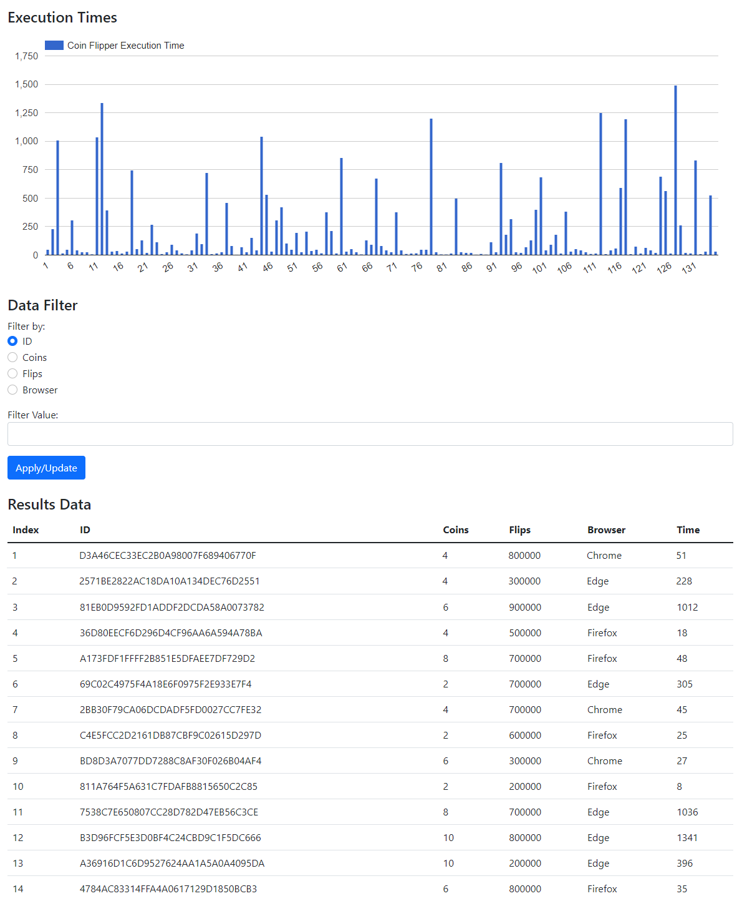
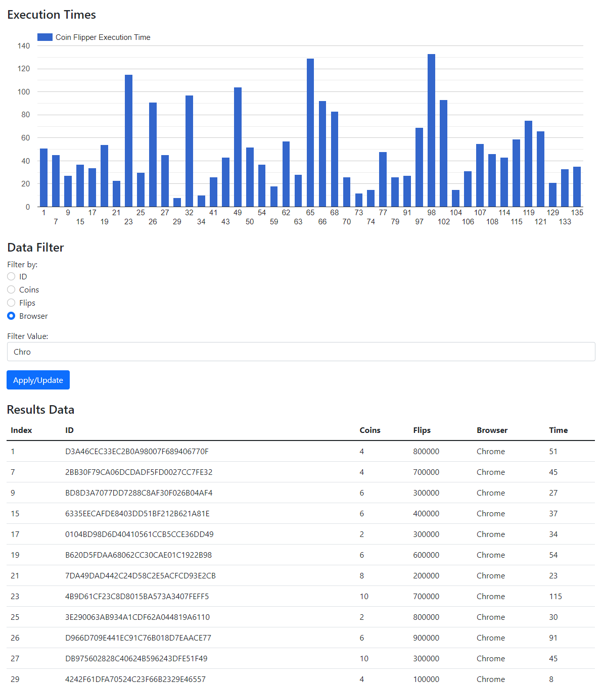

## Introduction

In this lab, you will be using JavaScript, Bootstrap, and a charting library to render graphs and filter data.

Work on the lab is to be done ***individually***.  You are welcome to collaborate with class members, but the project must be your own work.

## Objectives

By the end of the lab you will be able to:

- Develop skills with Bootstrap and external JavaScript libraries
- Enhance your HTML, CSS, and JavaScript development skills
- Use Bootstrap to create a responsive HTML page
- Use JavaScript to access and modify the DOM
- Define and implement event handlers, callbacks, and animations
- Use a charting library to draw graphs

## References

You will be using Google chart and data APIs for this lab.  The following references might be useful:

- Google Charts Home Page: https://developers.google.com/chartLinks to an external site.
- Google Charts Column Chart Reference: https://developers.google.com/chart/interactive/docs/gallery/columnchartLinks to an external site.
- Google Charts Visualization Reference: https://developers.google.com/chart/interactive/docs/referenceLinks to an external site.

You will also need to filter and manipulate arrays for this lab.  The following references to JavaScript array manipulation might be useful:

- Mozilla Developer Network Reference on JavaScript Arrays: https://developer.mozilla.org/en-US/docs/Web/JavaScript/Reference/Global_Objects/ArrayLinks to an external site.
- Array.filter Reference: https://developer.mozilla.org/en-US/docs/Web/JavaScript/Reference/Global_Objects/Array/filterLinks to an external site.
- Array.map Reference: https://developer.mozilla.org/en-US/docs/Web/JavaScript/Reference/Global_Objects/Array/map

## Background

Recall that in JavaScript, an object can be defined literally:

```
let person = {
    name: "roscoe", 
    age: 21,
};
```

In this case, the person object has properties that can be accessed as person.name and person.age.

Also, recall that in JavaScript, an array can be defined literally:

```
let charList = ["a", "b", "c"];
```

In this case, the charList array elements can be accessed individually as ```charList[0]```, ```charList[1]```, etc.

Combining the two concepts, we can define a literal array of objects:

```
let people = [
  { name: "roscoe", age: 21},
  { name: "rhonda", age: 22},
];
```

We can access the first person's name as ```people[0].name```, etc.

## Lab Project

For this project, you will create a web application that presents CoinFlipper results in a table format as well as a graphical chart format.  The application will also include a user interface to allow the user to filter the data displayed in both the chart and the table.

### Part 1: Displaying the Data

The data for the table and chart is given in a pre-defined JavaScript array of objects.  Each object entry contains a unique identifier, the number of coins, to number of flips, the name of the browser, and the time (in milliseconds) to run the CoinFlipper for that result.

For example:

```
let results = 
[
  {
    id: "735C083B4F51230A23A372CB5C7CB350",
    coins: 10,
    flips: 100000,
    browser: "Chrome",
    time: 300,
  },
  {
    id: "D290A70372961ED573A9A6BB58B17265",
    coins: 5,
    flips: 1000,
    browser: "Firefox",
    time: 100,     
  },
  ...etc
];
```

The table must display the data for each object in rows.  The data for each object entry must be displayed in columns in the following order:

1. The index of the entry.  The index is the position of the entry within the array.  <br/>NOTE: In order for the chart to be displayed correctly the index should be '1' based.  So you will need to add 1 to the array index
2. The unique identifier
3. The number of coins 
4. The number of flips 
5. The name of the browser 
6. The time to run the CoinFlipper 

The chart presents the index of the object entry on the horizontal axis (same as the index in the table).  The vertical axis is the time to run the CoinFlipper (also appearing in the last column of the table) corresponding to that index.



### Part 2: Filtering the Data

Your web application must also allow the user to filter the displayed data based on values typed into a filter box along with a set of radio buttons to set the filter type.

For example, if the selects the "Browser" filter and types "Chro", only object entries containing the string "Chro" for the browser are displayed in the table as well as shown in the chart.

NOTE: The filter string is a substring value match.  The user does not have to type the entire browser name to match.

NOTE: The original index numbers must be retained in the table.  Do ***NOT*** regenerate the table with fewer rows.  A hint is given in the CoinFlipCharter.js file that may help.

HINT: you may want to assign each ```<tr>``` an id in order to make selection easier.

The following describes how each column filter works:

1. Unique ID Filter - Does a substring match 
2. Coins Filter - Numeric match.  The number the user enters must match the object entry exactly 
3. Flips Filter - Numeric match.  The number the user enters must match the object entry exactly 
4. Browser Filter - Does a substring match

NOTE: You can assume valid user input (i.e. you do not need to verify that an input is numeric)

NOTE: If nothing is typed into the "Filter Value" text field then display all the data (do not actually filter anything).



## Formatting

- Use Bootstrap to format your buttons, table, text fields, radio buttons, etc.
- The table must be "responsive" and resize itself as the browser window size is changed
- When filtered bars should be evenly spaced as shown in Figure 2
- Be creative with your styling.  Your web app does ***NOT*** need to look exactly like the figures but each element should be styled in some way.

## Getting Started

Create a WebStorm project for this lab.  In the project you will need the files included in the repository:

- [CoinFlipCharter.html](src/CoinFlipCharter.html) - Web page HTML file (includes the imports for Bootstrap, Google Charts, and the CoinFlipCharter JavaScript files)
  - Do ***NOT*** forget to add Bootstrap formatting to this file - be creative!
- [CoinFlipCharter.js](src/CoinFlipCharter.js) - JavaScript source file containing your event handlers and manipulation of the DOM 
- [CoinFlipData.js](src/CoinFlipData.js) - JavaScript source containing a single variable declaration with the CoinFlipper data

At the top of EACH FILE include a comment block with your name, lab name, and section number.

## Deliverables

When you are ready to submit your lab:

- Make sure your name, lab name, and section number are in comments on ALL HTML, CSS, and JS file(s).
- ALSO, include in your source file(s) a set of suggestions for improvement and/or what you enjoyed about this lab.
- Make sure your JavaScript code is commented thoroughly.

NOTE: If/when using resources from material outside what was presented in class (e.g., Google search, Stack Overflow, etc.) document the resource used in your submission.  Include exact URLs for web pages where appropriate.

To submit, create a new release on your repository to tag it as being ready to submit.  Copy the URL for the release and submit the link to Canvas.

## Grading Criteria (85 Points)

- (5 Points) Correct Submission - Followed submission instructions (e.g. IDE project files are not submitted)
- (5 Points) Suggestions - a list of suggestions for improvement and/or what you enjoyed about this lab
- (5 Points) Correct Submission - Followed submission instructions (e.g. IDE project files are not submitted)
- (10 Points) Code Structure
  - Correct code/file structure
  - Code passes the HTML validator without errors
  - Code passes the CSS validator without errors
- (40 Points) Functionality - Correct implementation of required functionality
  - Data is properly displayed in the chart with indexes starting at 1
  - Data is properly displayed in the table
  - All filters correctly update the chart and table
  - Table rows are hidden when filtered and the table is not redrawn
- (25 Points) Styling
  - Web page contains required styling using Bootstrap
  - Additional custom styling is created