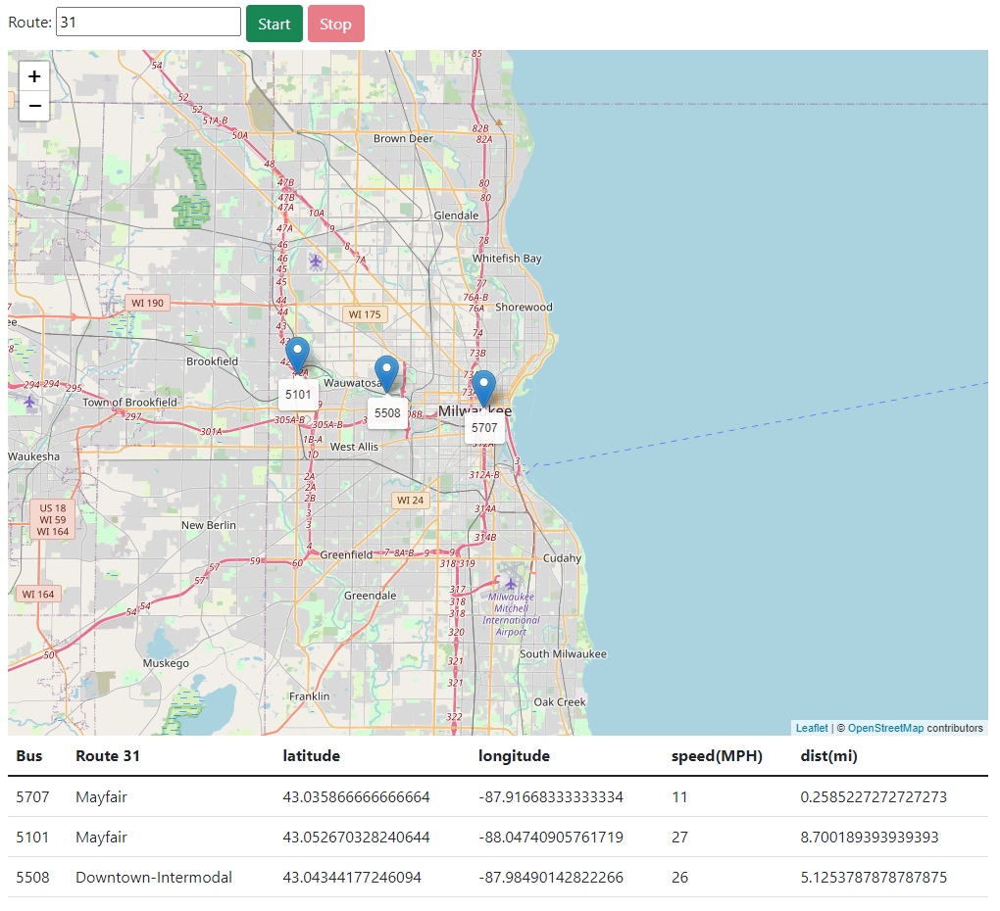
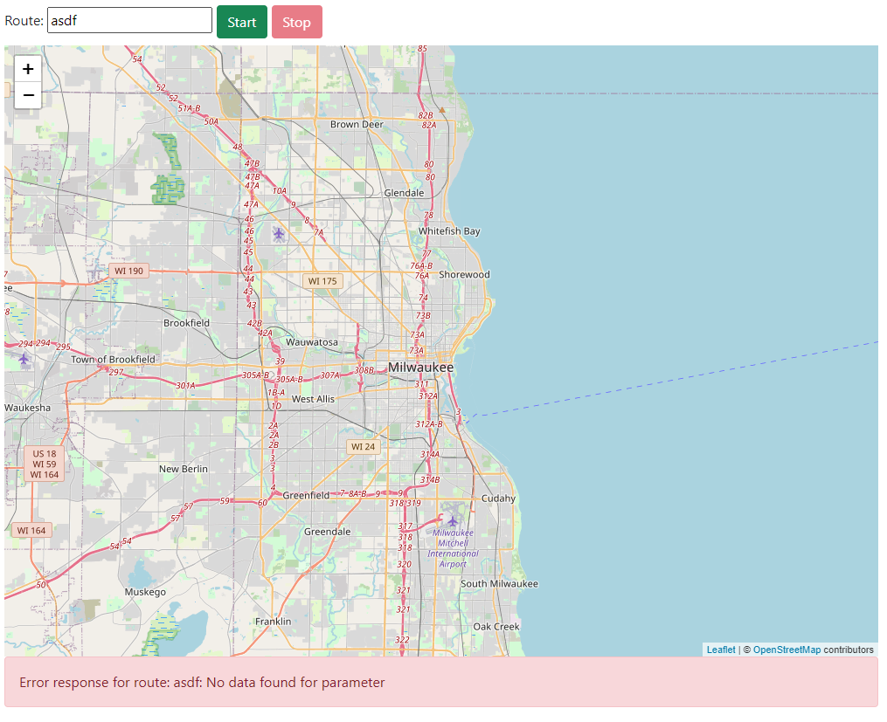
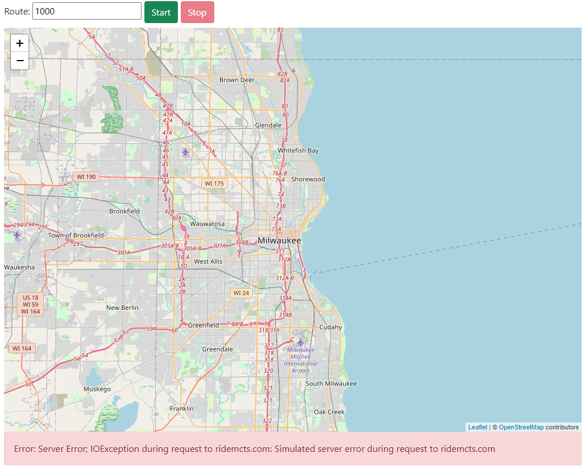

## Introduction

In this assignment, you will write an application that uses asynchronous requests to dynamically update a web app with data retrieved from a server.  You will also be using a 3rd party library to display retrieved data on a map.

Work on the assignment is to be done ***individually***.  You are welcome to collaborate with class members, but the project must be your own work.

## Objectives

By the end of the assignment you will be able to:

- Develop JavaScript and Bootstrap development skills
- Enhance your HTML, CSS, and JavaScript development skills
- Use JavaScript fetch to send and received data from a server using an asynchronous request.

## Background and Check-off

### Milwaukee County Transit System (MCTS) Web Services

The Milwaukee County Transit System (MCTS) maintains a website where you can obtain information about busses currently running on various routes.

You can get a feel for the information available by looking at the [MCTS real-time online bus map](http://realtime.ridemcts.com/bustime/map/displaymap.jsp):

- Visit the page
- Click on Routes
- Select a route
- Zoom in on the map

This server can also serve up raw data in JavaScript Object Notation (JSON) format that can be retrieved by anyone who knows how to access it. You can retrieve the data from any route - for example, the Green Line (Bayshore to the airport) is labeled as "GRE".

For this assignment, you will be using this MCTS Application Programming Interface (API) web service.  Doing so requires a free developer's license key.

Before starting the assignment you will need to create an account and request a key for the MCTS web service:

- Create an account: [http://realtime.ridemcts.com/bustime/createAccount.jsp](http://realtime.ridemcts.com/bustime/createAccount.jsp)
- Once you create an account sign in and request a key by clicking on "My API" in the top navigation bar

NOTE: You must demonstrate that you have retrieved your key to your instructor by the ***end of the week***.

### Accessing the MCTS real-time data

You can access the MCTS data by pointing your browser at the following:

[https://msoe-web-apps.appspot.com/BusInfo?key=XXXXXXXXXXXXXXX&rt=YYYYY](https://msoe-web-apps.appspot.com/BusInfo?key=XXXXXXXXXXXXXXX&rt=YYYYY)

- Replace ```XXXXXXXXXXXXXXX``` with your MCTS developer key
- Replace ```YYYYY``` with the route name that you are querying

NOTE: You will have to be careful about how frequently you retrieve data from the MCTS server.  More than one access per second may result in being locked out of the site.  If locked out you will have to wait a couple of hours for your account to be activated again.

Use this method to demonstrate that you have successfully created an MCTS account and key to your instructor.  In other words, send a URL with your key and a route that will successfully retrieve route data to your instructor.

### Leaflet

Leaflet ([https://leafletjs.com/](https://leafletjs.com/)) is a free JavaScript library for displaying and interacting with maps.  It lets you display a map at a particular location, add pinpoints, zoom in and out, etc.  However, as a user of the library you are required to provide your own map image.  For that, we will use OpenStreetMap ([https://www.openstreetmap.org/](https://www.openstreetmap.org/)) which is free open source map data.

## References

The following is helpful reference:

- Leaflet API Documentation: [https://leafletjs.com/reference.html](https://leafletjs.com/reference.html)
- MCTS API Documentation: [http://realtime.ridemcts.com/bustime/apidoc/docs/DeveloperAPIGuide2_0.pdf](http://realtime.ridemcts.com/bustime/apidoc/docs/DeveloperAPIGuide2_0.pdf)
- JavaScript Fetch API: [https://developer.mozilla.org/en-US/docs/Web/API/Fetch_API/Using_Fetch](https://developer.mozilla.org/en-US/docs/Web/API/Fetch_API/Using_Fetch)

NOTE: For this assignment you will be using version 2 of the MCTS API.

## Assignment Project

For this project, you will write a web app that regularly tracks the bus information in a table format as well as on a Leaflet Map.

### Bus Tracker Behavior

The behavior of your bus tracker should be as follows:

1. The user should select a route via its route identifier and type it into the "Route" field
2. Initially the start button should be enabled and the "Stop" button should be disabled
3. When the user clicks "Start", the current locations for all buses should be displayed in the map using a map marker for the route the user specified.
4. Map markers should have the bus number displayed below them
   - HINT: [https://leafletjs.com/reference.html#tooltip](https://leafletjs.com/reference.html#tooltip)<br/>
     See the parameter options for "permanent" which forces the tooltip to be "open" always 
   - Also, see the option for "offset" which allows you to move the tooltip relative to marker
5. New map markers should be added as buses move every 5 seconds<br/>
   NOTE: you do ***NOT*** need to remove old markers for buses while the tracker is running 
6. When the mouse clicks on a marker, the bus's route appears in a popup.<br/>
   HINT: [https://leafletjs.com/reference.html#popup](https://leafletjs.com/reference.html#popup)
7. The map should stop updating (but continue to show existing markers) when the user clicks "Stop"
8. Selecting a new route and pressing "Start" causes new markers to be added for the new route 

You should also display each bus's information for the route in a table below the map.  The table should display:

- The bus number
- The bus destination 
- The bus location (latitude and longitude)
- The bus speed in miles per hour (MPS)
- The bus traveling distance in miles (mi)

NOTE: The route number must also be displayed in the header of the table as the header for the bus destination.

On each update the bus information for each bus should be updated in the table to reflect their current values.  You can do this by directly updating the table or destroying and recreating the entire table.

When everything is working, your tracker should look like this:



While running:

- The "Start" button should be disabled
- The "Route" text input field should be disabled
- The "Stop" button should be enabled

When not running:

- The "Start" button should be enabled
- The "Route" text input field should be enabled
- The "Stop" button should be disabled

NOTE: If the user enters an invalid route or some other error message is returned from the MCTS API:

- Display an appropriate error message to the user.  Do ***NOT*** use an alert box for this.  
- Stop the bus tracker.  You do ***NOT*** need to clear the map markers or the table of rows when an error message occurs.

NOTE: If an error occurs at any time (either due to user input that is not valid or an error message from the server) stop updating ***IMMEDIATELY***.

If the bus route information is successfully retrieved, set an interval to update every 5 seconds (see [setInterval](https://www.w3schools.com/jsref/met_win_setinterval.asp) documentation for help with this).  At each update add new markers for the buses' current locations.

### Bus Tracker Data

Recall that you can access the MCTS data using a URL like the following: https://msoe-web-apps.appspot.com/BusInfo?key=XXXXXXXXXXXXXXX&rt=31

This request asks the server to supply a JSON collection of bus data for all buses currently on route 31. For details on the API supported by the MCTS server, consult the online documentation.

The JSON response should look something like this (but it varies in real-time as buses move):

```
{
   "bustime-response":{
      "vehicle":[
         {
            "vid":"5316",
            "tmstmp":"20210104 12:09",
            "lat":"43.04314809856993",
            "lon":"-87.92716506033233",
            "hdg":"359",
            "pid":10674,
            "rt":"31",
            "des":"Innovation Drive (via State)",
            "pdist":7044,
            "dly":false,
            "spd":16,
            "tatripid":"34506333",
            "tablockid":"31 -303",
            "zone":""
         },
         {
            "vid":"5342",
            "tmstmp":"20210104 12:09",
            "lat":"43.042115347726",
            "lon":"-87.92717184339251",
            "hdg":"180",
            "pid":10716,
            "rt":"31",
            "des":"Downtown/Intermodal",
            "pdist":41893,
            "dly":false,
            "spd":21,
            "tatripid":"34506309",
            "tablockid":"31 -304",
            "zone":""
         },
         {
            "vid":"5213",
            "tmstmp":"20210104 12:08",
            "lat":"43.067054748535156",
            "lon":"-88.04571533203125",
            "hdg":"6",
            "pid":10760,
            "rt":"31",
            "des":"Mayfair (via Vliet)",
            "pdist":49233,
            "dly":false,
            "spd":0,
            "tatripid":"34506321",
            "tablockid":"31 -301",
            "zone":""
         },
         {
            "vid":"5212",
            "tmstmp":"20210104 12:09",
            "lat":"43.04003411370355",
            "lon":"-88.02081566887932",
            "hdg":"65",
            "pid":10939,
            "rt":"31",
            "des":"Downtown/Intermodal",
            "pdist":13593,
            "dly":false,
            "spd":18,
            "tatripid":"34506300",
            "tablockid":"31 -302",
            "zone":""
         }
      ]
   }
}
```

The following will be helpful for determining bus data to display on the map and in the table.

| Bus Data Value               | JSON Field Name |
|------------------------------|-----------------|
| Route Number                 | rt              |
| Bus Number                   | vid             |
| Destination                  | des             |
| Bus Latitude                 | lat             |
| Bus Longitude                | lon             |
| Bus Speed (MPH)              | spd             |
| Bus Traveled Distance (feet) | pdist           |

NOTE: The traveled distance is reported by MCTS in ***feet***.  Your table should show the distance in ***miles***.  Make sure you do the correct math to convert the value.

### Warning When Referencing Bus Data 

Notice that the response 'bustime-response' has a dash in it.  As a result you will NOT be able to access that as a JavaScript property.  Dash in JavaScript (and in many other languages) is interpreted as subtraction.

So while the following looks like the way to access the JavaScript object for the bustime-response, it is not correct:

```
const value = response.bustime-response.vehicle[0]
```

JavaScript actually interprets this as the subtraction of two values.  If we added white space the following would be equivalent:

```
const value = response.bustime - response.vehicle[0]
```

Now it should become more obvious that this is an error.

Instead, you will have to access the data using array brackets for associative reference.  For example:

```
const value = response["bustime-response"].vehicle[0]
```

### Using the Fetch API

You will need to use the fetch JavaScript API to make your requests for the MCTS data.  Remember that this API uses promises to perform the asynchronous request.  You are welcome to use the .then/.catch interface or the async/await to manage the data.  Recall that the response from a fetch represents the HTTP response as a whole.  To get the JSON data from the body you will need to invoke the JSON API.  This is also asynchronous and returns a promise.

Furthermore, recall that the fetch API only throws an error when there is a connection problem with the server.  If it receives a response from the server, even if it is an error, then fetch will not reject the promise.  You will have to manually check the response status to detect an error.

For example if you have a function called ```updateMap``` that updates the map based on JSON data and a function called ```handleError``` for handling errors, then using the .then/.catch you might write something like:

```javascript
fetch(URL)
   .then((response) => {
       if(response.status !== 200) {
           throw new Error(String(response.status));
       }
       return response.json();
   })
   .then((responseJSON) => updateMap(responseJSON))
   .catch((error) => handleError(error));
```

Using async/await, it might look like:

```javascript
try {
    const response = await fetch(URL);
    if(response.status !== 200) {
        handleError(String(response.status))
        return;
    } else {
        const responseJSON = await response.json();
        updateMap(responseJSON);
    }
} catch(error) {
    handleError(error);
}
```

However, these are just examples.  Feel free to implement your fetch request as works best for you.

## Getting Started

Create a WebStorm project for this assignment.  In the project you will need the files included in the repository:

- [BusTracker.html](src/BusTracker.html) - Web page HTML file (includes the imports for Bootstrap, Leaflet, and the BusTracker CSS and JavaScript files)
- [BusTracker.css](src/BusTracker.css) - Initial styling to set up the sizes for the map
- [BusTracker.js](src/BusTracker.js) - JavaScript source file containing your event handlers and manipulation of the DOM

At the top of EACH FILE include a comment block with your name, assignment name, and section number.

The provided HTML is a starting point.  Feel free to modify the structure and styling as you like.  Just make sure your application meets the required functionality.

Remember to create your MCTS developer key before you get started.

Possible changes you might want to make:

- Reorganize the user interface
- Move the map to a different place on the page
- Change the map size
- Alter other styling of the table, buttons, input field, etc.

## Validation and Testing

Your application must be able to handle errors.  There are several errors that can be sent by the MCTS server.  For example,

- No response from server (AJAX request fails due to a network failure, server timeout, or other server error)<br/>
  Here, no JSON response will be received from the server - your AJAX error handler will be invoked
- Missing key or route in AJAX request
- Invalid key specified in AJAX request
- Invalid route specified in AJAX request

For the latter errors, different JSON responses will be received that you must distinguish from a normal response.

The server you will be using has been purposely modified to allow you to force these errors to occur for testing purposes, as follows:

- If you supply a route parameter with value 1000, the server will simulate an internal error. The AJAX request will succeed, but the JSON response will contain an error indication.
- If you supply a route parameter with value 1001, the server will pretend it received a bad AJAX request. The AJAX request will fail.
- If you supply a route parameter with value 1002, the server will pretend that you didn't supply a key or route. The AJAX request will succeed, but the JSON response will contain an error indication.
- If you supply a route parameter with value 1003, the server will intercept the key you pass and substitute an invalid key. The AJAX request will succeed, but the JSON response will contain an error indication.

NOTE: In all cases, you must present a meaningful error message to the user on the web page.  Do ***NOT*** use an alert box to display an error message.  Bootstrap has some components that might be useful for displaying error messages.  For example, consider using a Bootstrap alert ([https://getbootstrap.com/docs/5.2/components/alerts/](https://getbootstrap.com/docs/5.2/components/alerts/)).

NOTE: Do ***NOT*** hard code these route numbers into your JavaScript code.  Your code ***MUST*** handle the response error data directly.

Bad Route Number:

 

Simulated Error for Route 1000:



## Extra Credit

You can receive 10 extra credit points (upon final submission).  Each of the following is worth 2 points

- Implement custom icons for the bus markers in place of push-pins (the default) representing the location of buses
- Delete the markers from the map when the "Stop" button is pressed ***AND*** when an error occurs
- Show only the last 10 markers (delete older ones) as the buses progress through their routes
- Add two more features of your own design (with prior approval from your instructor)

## Deliverables

When you are ready to submit your assignment:

- Make sure your name, assignment name, and section number are in comments on ***ALL*** HTML, CSS, and JS file(s).
- ALSO, include in your source file(s) a set of suggestions for improvement and/or what you enjoyed about this assignment.
- Make sure your assignment code is commented thoroughly.
- Make sure all files are committed and pushed to the main branch of your repository.

NOTE: If/when using resources from material outside what was presented in class (e.g., Google search, Stack Overflow, etc.) document the resource used in your submission.  Include exact URLs for web pages where appropriate.

To submit, create a new release on your repository to tag it as being ready to submit.  Copy the URL for the release and submit the link to Canvas.

## Grading Criteria (85 Points)

- (5 Points) Correct Submission - Followed submission instructions (e.g. files are updated with name, assignment, section, sources are cited, etc.)
- (5 Points) Suggestions - a list of suggestions for improvement and/or what you enjoyed about this assignment
- (5 Points) Key Checkoff - Demonstrated that your MCTS account with API key has been correctly created
- (10 Points) Code Structure
    - Correct code/file structure
    - Code passes the HTML validator without errors
    - Code passes the CSS validator without errors
- (60 Points) Functionality - Correct implementation of required functionality
    - Retrieval and validation of user input
    - Bus locations correctly displayed in the map with markers
    - Bus markers are correctly labeled
    - Data is properly displayed in the table
    - Table is correctly labeled
    - Table data is correctly displayed
    - Error are correctly handled and displayed to the user
      - Debug error routes are not hard coded in the JavaScript Code
- (10 Points) Implementation of extra credit features